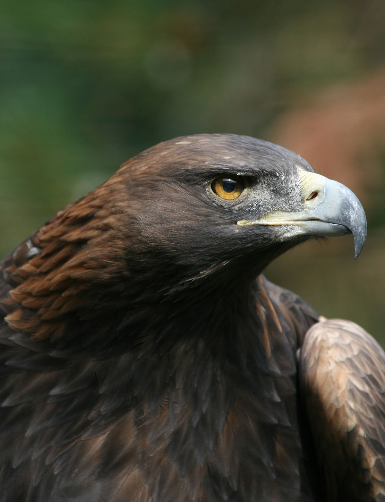

<!DOCTYPE html>
<md lang="es">
<head>
    
<title>Aguila</title>
</head>

<body class="tipo2">
    <h2 class="tipo5">Aguila</h2>
    <h4 class="tipo4">(Aquila chrysaetos)</h4>
    

   

 
 

    Como todas las aves de presa, las águilas poseen un pico grande, poderoso y puntiagudo para desprender la carne de su presa. 
    Cuentan también con tarsos y garras poderosas. Llama también la atención la fuerza de las águilas, que les posibilita alzar en 
    vuelo a presas mucho más pesadas que ellas. Además poseen una vista extremadamente aguda que les permite visualizar potenciales
    presas a distancia, por ejemplo el águila real posee dos puntos focales en sus ojos, uno para mirar de frente y otro para localizar 
    la mirada hacia los costados escudriñando a la distancia.
 

 <marquee class="tipo7">
    Caracteristicas
 </marquee>
 
 <ol type="1" class="tipo9">
    <li>Como todas las aves de presa, las águilas poseen un pico grande, poderoso y puntiagudo para desprender la carne de su presa. </li>
    <li>  Cuentan también con tarsos y garras poderosas. Llama también la atención la fuerza de las águilas, que les posibilita alzar en vuelo a presas mucho más pesadas que ellas.</li>
    <li>. Además poseen una vista extremadamente aguda que les permite visualizar potenciales presas a distancia, por ejemplo el águila real posee dos puntos focales en sus ojos, uno para mirar de frente y otro para localizar la mirada hacia los costados escudriñando a la distancia. </li>
    <li> El águila real  se distribuye por Eurasia y Norteamérica. ... El hábitat del águila real son las zonas montañosas o accidentadas en las que reina la tranquilidad. Normalmente, se sitúan cerca de lugares con poco arbolado, buena visibilidad para la caza y una gran abundancia de presas </li>
    <li> Sus presas suelen ser pequeños o medianos mamíferos, como lagomorfos, mustélidos y roedores. Además, muchas consumen otras aves más pequeñas. Como veremos después, algunas águilas se especializan en cazar presas muy específicas, como algunas águilas que se alimentan solo de peces. </li>

 </ol>

<pre class="Hyper">
<a href="index.html">Regresar a la pagina principal</a>
</pre>
</body>
</md>