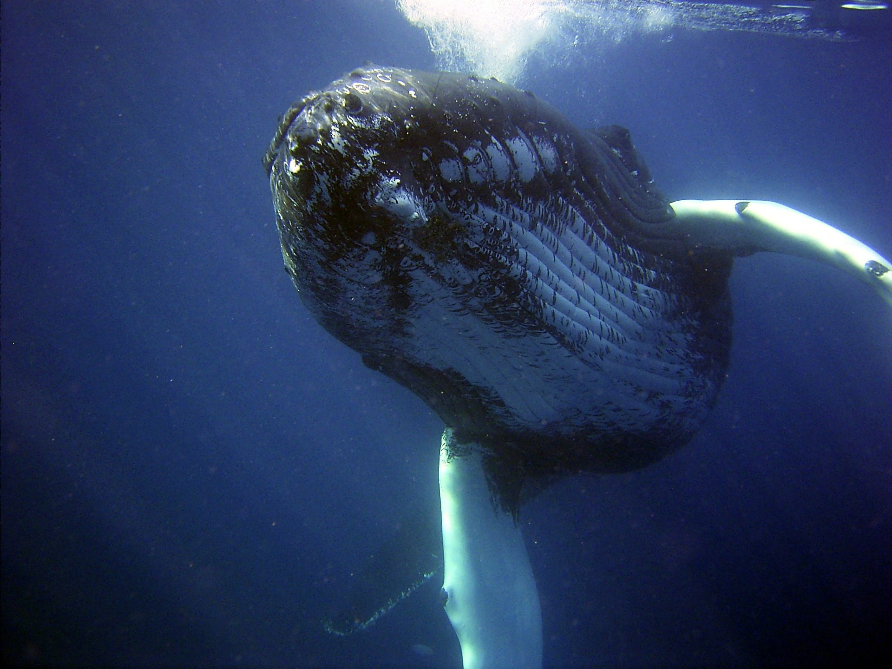

<!DOCTYPE html>
<html lang="es">
<head>
    
<title>Ballena</title>
</head>

<body class="tipo2">
    <h2 class="tipo5">Ballena</h2>
    <h4 class="tipo4">(Balaenidae)</h4>
    

   

 
 

   Los balénidos son un afamilia de cetáceos misticetos que incluyen solo cuatro especies, distribuidas en dos géneros, Balaena y Eubalaena,
    las ballenas es uno de los animales mas grandes que han existido, las ballenas son cosmopolitas es decir que viven prácticamente en todos 
    los oceanos, en siglos pasados las ballenas eran cazadas por su aceite, y materaia prima para realizar cosmeticos, actualmente la caza de 
    ballenas esta prohibida.
 

 <marquee class="tipo7">
    Caracteristicas
 </marquee>
 
 <ol type="1" class="tipo9">
    <li>Son cetáceos y no peces porque tienen sangre caliente.</li>
    <li>Llegan a medir entre 14m a 16m.</li>
    <li>Viven en cualquier parte del océano.</li>
    <li>Se alimentan de Krill, plancton y de pequeños crustáceos.</li>
    <li>Las ballenas bebes de alimentan de leche materna.</li>
 </ol>

<pre class="Hyper">
<a href="index.html">Regresar a la pagina principal</a>
</pre>
</body>
</html>
