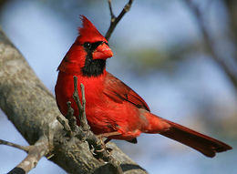

<html lang="es">
<head>
    
<title>Cardenal</title>
</head>

<body class="tipo2">
    <h2 class="tipo5">Cardenal</h2>
    <h4 class="tipo4">(Cardinalis cardinalis)</h4>
    

   

 
 

    El cardenal norteño es un pájaro cantor de tamaño medio con una longitud corporal de 21-23 cm. 
    Tiene un distintivo penacho y una máscara en la cara que es negra en el macho y gris en la hembra. 
    Presenta dimorfismo sexual en su coloración; el plumaje del macho es rojo brillante, mientras que 
    el de la hembra es de un tono opaco que mezcla rojo y café. 
    El cardenal norteño es predominantemente granívoro, pero también se alimenta de insectos y fruta.
 

 <marquee class="tipo7">
    Caracteristicas
 </marquee>
 
 <ol type="1" class="tipo9">
    <li>El cardenal norteño es una de las tres especies incluidas dentro del género Cardinalis (junto con el cardenal pardo y el cardenal bermellón) que pertenece a la familia Cardinalidae, la cual está conformada por pájaros que habitan tanto en América del Norte y América del Sur.</li>
    <li> El cardenal rojo es abundante en el este de los Estados Unidos desde el estado de Maine hasta Texas y en Canadá en las provincias de Ontario, Quebec y Nueva Escocia. Su área de distribución se extiende hacia el oeste hacia la frontera entre Estados Unidos y México y hacia el sur a través de la zona costera oriental de México pasando por el istmo de Tehuantepec y llegando hasta el norte de Guatemala, Belice, Colombia y Venezuela. Fue introducido en las Bermudas en 1700. También ha sido introducido en Hawái y el sur de California. </li>
    <li> Su hábitat natural son los bosques, los jardines y los pantanos.15 Esta ave reside permanentemente en su área de distribución, es decir, no es ave migratoria, aunque puede trasladarse a otros sitios para eludir el clima extremo o si la comida escasea. </li>
    <li> El cardenal rojo es un ave territorial. El macho canta con un silbido fuerte y claro desde la copa de un árbol u otro punto elevado para delimitar su territorio. Puede perseguir y agredir a otros machos que ingresen a su territorio. El cardenal norteño aprende sus canciones, y como resultado las canciones varían regionalmente. Es capaz de distinguir fácilmente el sexo de otro cardenal norteño que se encuentre cantando tan solo por su canción.17 Ambos sexos cantan patrones de canciones claros, los cuales son repetidos varias veces, y después varían.</li>
    <li> El cardenal rojo tiene una señal de alerta distintiva, un rápido sonido metálico que suena como 'chip'. Esta alerta se suele dar cuando un depredador se acerca al nido, a fin de advertirle a la hembra y a los polluelos</li>

 </ol>

<pre class="Hyper">
<a href="index.html">Regresar a la pagina principal</a>
</pre>
</body>
</html>