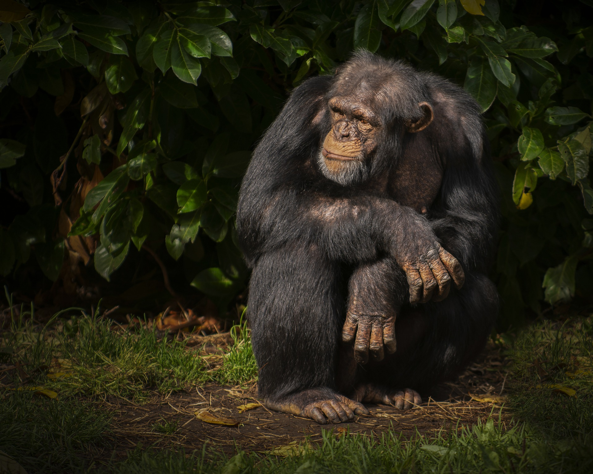

<!DOCTYPE html>
<html lang="es">
<head>
    
<title>Chimpancé</title>
</head>

<body class="tipo2">
    <h2 class="tipo5">Chimpancé</h2>
    <h4 class="tipo4">(Pan)</h4>
    

   

 
 

    El chimpancé está considerado un primate exclusivo de África y su distribución 
    se ha reducido mucho en los últimos siglos. Esta especie está muy ligada a los 
    árboles, pues vive normalmente en el bosque húmedo tropical y los bosques de sabana.
 

 <marquee class="tipo7">
    Caracteristicas
 </marquee>
 
 <ol type="1" class="tipo9">
    <li>Puede llegar a pesar 70 kilogramos en el caso de los machos, pues las hembras pesan un poco menos.</li>
    <li>En posición erguida puede llegar a 1,60 metros de altura.</li>
    <li>Los brazos de los chimpancés son muy largos, lo que permite a esta especie moverse con agilidad a cuatro patas.</li>
    <li>Un chimpancé puede llegar a vivir 60 años.</li>
    <li>V El dedo grande del pie también es oponible, lo que hace que sus pies sean muy versátiles.</li>
 </ol>

<pre class="Hyper">
<a href="index.html">Regresar a la pagina principal</a>
</pre>
</body>
</html>
