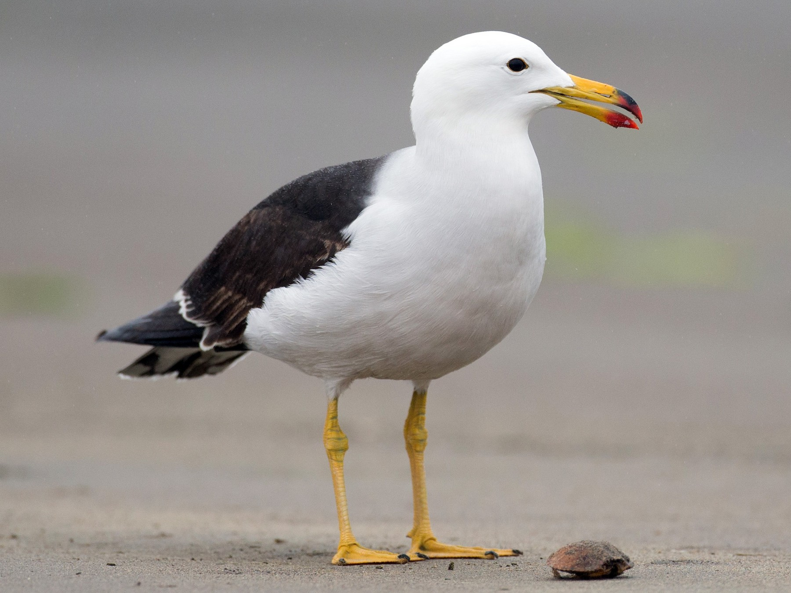

<!DOCTYPE html>
<html lang="es">
<head>
    
<title>Gaviota</title>
</head>

<body class="tipo2">
    <h2 class="tipo5">Gaviota</h2>
    <h4 class="tipo4">(Laridae)</h4>
    

   

 
 

    Las gaviotas son un grupo de aves clasificadas dentro del orden Charadriiformes y familia Laridae,
    pertenecientes al suborden Lari. Están estrechamente relacionados con los charranes, (Sternidae), 
    los cuales eran considerados una subfamilia de las gaviotas. Laridae está compuestos por diez géneros y 
    56 especies. Hasta el siglo XXI, la mayoría de las gaviotas fueron colocadas en el género Larus, 
    pero este arreglo es ahora conocido por ser polifilético, lo que lleva a la resurrección de varios géneros
 

 <marquee class="tipo7">
    Caracteristicas
 </marquee>
 
 <ol type="1" class="tipo9">
    <li>Las gaviotas son aves entre medianas y grandes, grises al ser crías y cambian al plumaje blanco cuando se hacen adultas, a menudo con marcas negras en la cabeza o las alas. </li>
    <li> Habitualmente producen llamadas ásperas que recuerdan el llanto o gruñidos, poseen un pico robusto y largo y sus pies son palmeados. La mayoría de las gaviotas, particularmente las especies de Larus, son omnívoras, predominantemente carnívoras, anidan en el suelo y capturan comida viva o la roban de manera oportunista. </li>
    <li> Las gaviotas anidan en colonias grandes, densamente pobladas y ruidosas. Ponen dos o tres huevos moteados en nidos compuestos de vegetación. Los jóvenes son precoces, nacidos con manchas moteadas oscuras y son capaces de moverse al nacer</li>
    <li> Las gaviotas -las especies más grandes en particular- son aves ingeniosas, curiosas e inteligentes,3 que demuestran complejos métodos de comunicación y una estructura social altamente desarrollada. </li>
    <li>Las gaviotas son ejemplares de aves marinas y son costeras. Su alimentación proviene de la pesca de peces, cangrejos, almejas, camarones,roedores etc. De igual manera se alimenta de otras aves, se come los huevos de los pájaros y a los pichones. También se alimenta de basura y es carroñera de todo tipo de desperdicios alimenticios </li>

 </ol>

<pre class="Hyper">
<a href="index.html">Regresar a la pagina principal</a>
</pre>
</body>
</html>
