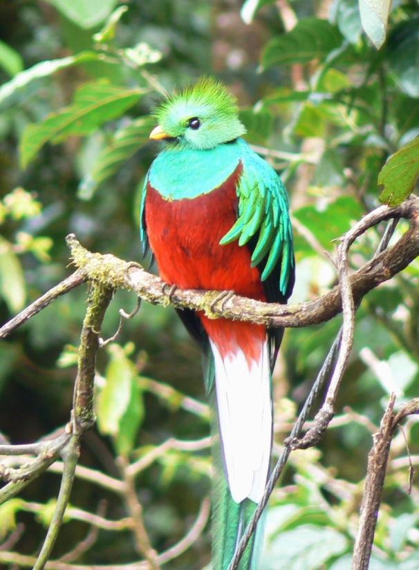

<!DOCTYPE html>
<html lang="es">
<head>
    
<title>Quetzal</title>
</head>

<body class="tipo2">
    <h2 class="tipo5">Quetzal</h2>
    <h4 class="tipo4">(Pharomachrus mocinno)</h4>
    

   

 
 

    Los quetzales (Pharomachrus) son un género de aves de la familia de los trogones (Trogonidae). 
    Se trata de una especie que en las civilizaciones maya era sagrado y su plumaje era utilizado para adornar 
    la indumentaria de los reyes y sacerdotes. 
    En otras diversas partes del mundo se le conoce como quetzal centroamericano y quetzal guatemalteco
 

 <marquee class="tipo7">
    Caracteristicas
 </marquee>
 
 <ol type="1" class="tipo9">
   <li>Se alimentan de frutos, principalmente de aguacates silvestres, insectos que atrapan al vuelo y de pequeños animales vertebrados como, lagartijas y ranas.</li>
   <li> El quetzal se encuentra principalmente en América Central y vive en países como Guatemala, Honduras, Costa Rica, El Salvador, Nicaragua y Panamá, pero también se le encuentra en partes del sur de México.</li>
   <li> Su hábitat son las selvas tropicales, pastizales y montañas con densa vegetación y clima húmedo o sub húmedo. Construye su nido en lo alto de los árboles inhabitados o en huecos que dejan los pájaros carpinteros.</li>
   <li> Las aves macho presentan plumas de color verde metálico y pecho rojo. Durante la etapa de reproducción, los machos desarrollan una cola de hasta 1 metro de longitud, lo cual contrasta con el cuerpo, cuya medida puede llegar a ser de 35 cm. Sin embargo, debido al dimorfismo sexual, las hembras presentan colores más opacos y no desarrollan cola.</li>
   <li>El quetzal es el ave nacional de Guatemala. Dice una leyenda guatemalteca que el quetzal solía cantar hermosamente antes de la conquista española y que ha quedado callado después, pero cantará otra vez cuando la tierra esté libre de verdad </li>

 </ol>

<pre class="Hyper">
<a href="index.html">Regresar a la pagina principal</a>
</pre>
</body>
</html>