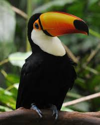

<!DOCTYPE html>
<html lang="es">
<head>
    
<title>Tucan</title>
</head>

<body class="tipo2">
    <h2 class="tipo5">Tucan</h2>
    <h4 class="tipo4">(Ramphastidae)</h4>
    

   

 
 

    Los ranfástidos (Ramphastidae), conocidos comúnmente como tucanes, diotedé o diostedé son una familia de aves
    ranfástidas del orden de los piciformes es muy amplia ya que alberga seis géneros y
    cuarenta y dos especies diferentes de tucanes. Se caracterizan por poseer un pico muy desarrollado y 
    de vivos colores. Miden entre 18 y 65 cm, siendo el tucán toco (Ramphastos toco) el de mayor tamaño. 
    Están ampliamente distribuido por el continente americano, desde México hasta Argentina. 
    Algunas especies están en selvas húmedas tropicales de baja altitud, mientras que otras habitan en 
    bosques más templados, en cordilleras, 
    a altitudes hasta los 3000 m s. n. m.. El nombre de este grupo de aves procede del guaraní
 

 <marquee class="tipo7">
    Caracteristicas
 </marquee>
 
 <ol type="1" class="tipo9">
    <li>Los tucanes son aves de plumas y pico de colores muy llamativos. Miden 65 centímetros y pesan de 130 hasta 680 g. Su pico es largo con una longitud aproximada de 20 cm y alcanzando su talla definitiva después de varios meses.</li>
    <li>Tiene pequeños dientes como sierras, llega a medir la tercera parte de su tamaño y es muy ligero por las numerosas cámaras que tiene por lo que no le dificulta el vuelo. Su lengua es muy larga (llega a medir hasta 14 cm), angosta, aplanada y termina en punta.  </li>
    <li> Tiene alas pequeñas, cortas y redondeadas. La cola es cuadrada en unas especies y llama la atención la facilidad con que la mueve hacia arriba y abajo.</li>
    <li>. Los ojos están rodeados por una piel que a veces es de colores vivos y la vista es su sentido más desarrollado. Las patas son cortas y fuertes, facilitando la sujeción a las ramas y el desplazamiento entre árboles.  </li>
    <li> Los tucanes se alimentan principalmente de bayas, semillas, frutos y fruta madura. En ocasiones lo hacen de insectos y otras presas como pequeñas lagartijas, pichones y huevos de otras aves, sobre todo en época de reproducción.</li>

 </ol>

<pre class="Hyper">
<a href="index.html">Regresar a la pagina principal</a>
</pre>
</body>
</html>