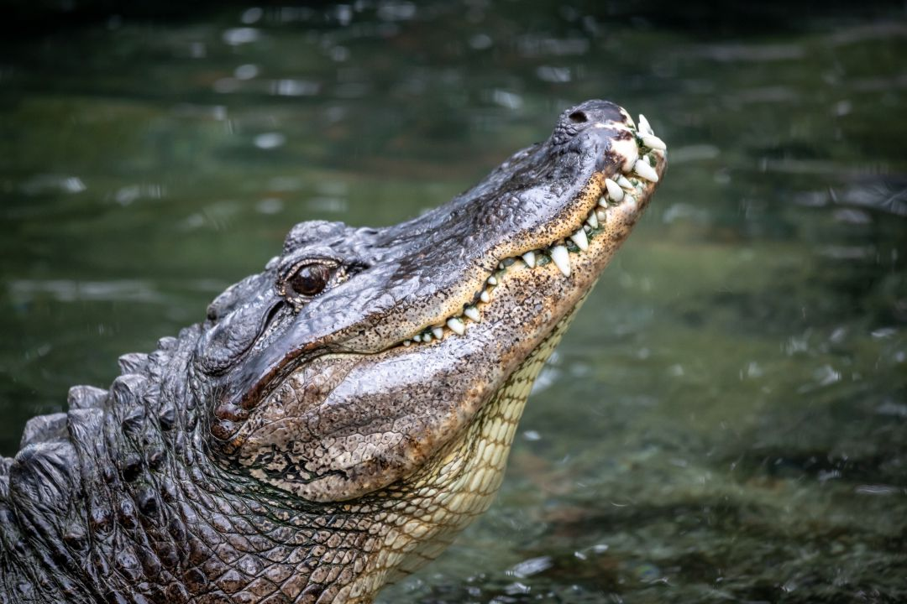
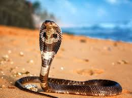

<html>
<head>
<title>reptiles</title>
<pre class="Hyper">
MENU
<a href=#cocodrilo>COCODRILO</a>
<a href=#dragon>DRAGON DE KOMODO</a>
<a href=#tortuga>TORTUGA CAREY</a>
<a href=#lagarto>LAGARTO</a>
<a href=#cobra>COBRA</a>

</pre>
</head>
<doby>
 <marquee class="tipo7">
    COCODRILO
 </marquee>
    

<body class="tipo2">
<a name=cocodrilo>COCODRILO</a>
    
   

 
 

    Se denomina comúnmente cocodrilo a cualquiera de las 14 especies pertenecientes a la familia 
    de los saurópsidos arcosaurios Crocodylidae. Estos reptiles viven en África, América, Asia y Australia y 
    los científicos estiman que aparecieron hace unos 55 millones de años, durante el Eoceno. 
    Con un modo de vida semiacuático, y con una tendencia a vivir en congregaciones, los cocodrilos son depredadores
    y se alimentan principalmente de otros animales vertebrados, aunque no es raro encontrar algunas especies 
    que se alimenten de moluscos y crustáceos.
 

 <ol type="1" class="tipo9">
    <li>Están dotados de una piel escamosa, muy dura y seca.</li>
    <li>Sus fosas nasales y sus ojos se encuentran en la parte superior de la cabeza,
    lo que le permite ver y respirar mientras permanece en el agua.</li>
    <li>USuelen pasar la mayor parte del día parados, a la espera de que una presa se 
    acerque lo suficiente como para lanzar un ataque súbito..</li>
    <li>Tienen además cuerpos pesados y metabolismos generalmente lentos.</li>
    <li>Los cocodrilos del Nilo, por ejemplo, pueden llegar a medir 6 metros y pesar hasta 730 kilos.</li>
 </ol>
<a href="Index.html">Regresar a la pagina principal</a>
<marquee class="tipo7">
    DRAGON DE KOMODO
 </marquee>

<a name=dragon de komodo>Dragon de komodo</a>
<body class="tipo2">
    
   

 
 

    Los dragones de Komodo habitan mayormente en las islas de la Sonda, en el archipiélago indonesio,
 incluyendo además las islas de Komodo, Flores, Gili Dasami, Gili Montang, Rinca y Padar. Por lo general, 
prefieren espacios abiertos de tierra con una vegetación moderada. Aun así, el hábitat de los dragones de Komodo
 también puede incluir otras áreas como playas y zonas costeras, elevaciones montañosas y riberas de ríos.
 Las especies más jóvenes de este lagarto habitan frecuentemente en lo alto de los árboles, aunque por lo general, cualquier zona cálida
 y con cierta vegetación será más que suficiente para que puedan vivir.
 

 <ol type="1" class="tipo9">
    <li>Los dientes del dragón de Komodo son de forma serrada, y pueden medir hasta 2.5 centímetros..</li>
    <li>Son capaces de avistar objetos a 300 metros de distancia.</li>
    <li>La piel del dragón de komodo está cubierta de escamas ásperas que le ofrecen una capa protectora.</li>
    <li>Tiene una lengua larga de color amarillo </li>
    <li>La dieta es exclusivamente carnívora, alimentándose a través de la caza y carroña.</li>
 </ol>
<a href="index.html">Regresar a la pagina principal</a>
<marquee class="tipo7">
   TORTUGA CAREY
 </marquee>

<a name=tortuga carey>Tortuga carey</a>

<body class="tipo2">
    
   

 
 

    Las tortugas carey se encuentran en las aguas tropicales de los océanos Atlántico, Pacífico e Índico.
    Evitan aguas profundas, y prefieren la costa donde las esponjas de las que les gusta alimentarse son
    abundantes y los lugares de anidación en la arena están al alcance. Estos reptiles sumamente migratorios 
    ayudan a mantener un ecosistema de arrecife de coral saludable.
 

 <ol type="1" class="tipo9">
    <li>llegan a medir hasta 114 centímetros.</li>
    <li>Llegan a pesar 68 kilogramos.</li>
    <li>Tienen un par de garras que adornan cada aleta.</li>
    <li>Sus caparazones duros las protegen de los muchos depredadores.</li>
    <li>Cavan un pozo en la arena, lo llenan con entre 130 y 160 huevos.</li>
 </ol>
<marquee class="tipo7">
   LAGARTO
 </marquee>

<a name=lagarto>Lagarto</a>
<body class="tipo2">
    
   

 
 

   Es posible encontrar al lagarto en cualquier parte del mundo, exceptuando la Antártida.
   Es conocido por su preferencia a las áreas tropicales hallándose en prados, montañas, zonas desérticas,
   húmedas o cercanas a fuentes de agua.
  También es capaz de vivir en zonas templadas o frías en cuyos ocasiones ralentizan el metabolismo.
  Asimismo adapta las funciones de su cuerpo, por lo que se le puede encontrar bajo piedras, en las fisuras de
   la tierra o en árboles, siendo grandes escaladores..
 

 <ol type="1" class="tipo9">
    <li>llegan a medir hasta 114 centímetros.</li>
    <li>Llegan a pesar 68 kilogramos.</li>
    <li>Tienen un par de garras que adornan cada aleta.</li>
    <li>Sus caparazones duros las protegen de los muchos depredadores.</li>
    <li>Cavan un pozo en la arena, lo llenan con entre 130 y 160 huevos.</li>
 </ol>
<a href="index.html">Regresar a la pagina principal</a>
<marquee class="tipo7">
   COBRA
 </marquee>

<a name=cobra>COBRA</a>
<body class="tipo2">
    
   

 
 

   La distribución comprende el Medio Oriente, Asia Central, Asia del Sur y Sudeste de Asia, en lo que respecta a Indonesia,
   Filipinas y el sur de China. Sin embargo, la gran mayoría se encuentran en África, excepto por el desierto del Sahara.

   Entre los principales hábitats de la cobra están las selvas tropicales, bosques, sabanas y desiertos.
  Según la especie pueden preferir los climas húmedos, templados o secos. Suelen vivir bajo tierra, bajo rocas, en arbustos y en los árboles.
 

 <ol type="1" class="tipo9">
    <li>El cuerpo es largo y delgado.</li>
    <li>El peso oscila entre los 6 y 12 kilogramos.</li>
    <li>Es un depredador carnívoro que se alimenta de diversas especies según su ubicación.</li>
    <li>El veneno de la cobra es neurotóxico, es decir, afecta el sistema nervioso.</li>
    <li>Es tranquila y temerosa, por lo que suele esconderse.</li>
 </ol>
<pre class="Hyper">
<a href="index.html">Regresar a la pagina principal</a>

</pre>
</body>
</html>
